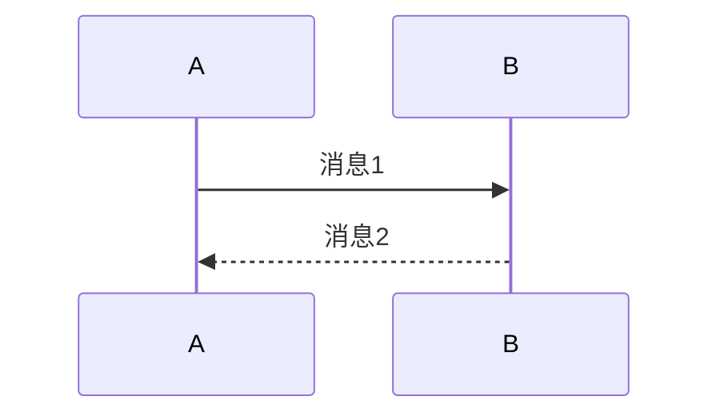
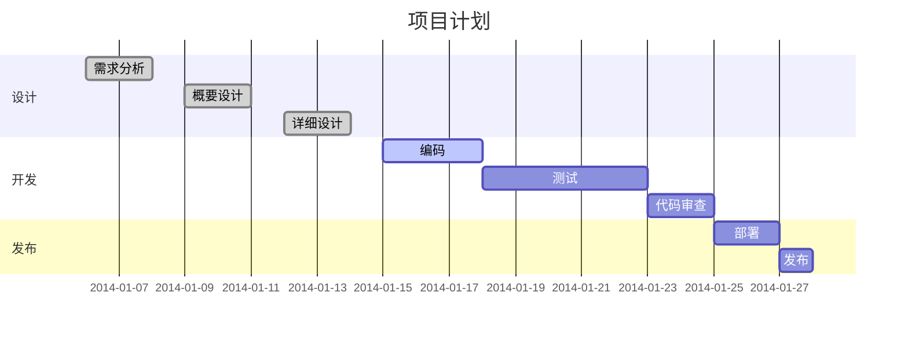

# Mermaid：抛弃「画图」，拥抱「码图」

“Mermaid：抛弃「画图」，拥抱「码图」”。简述Mermaid码图的优势，教你如何在Typora使用Mermaid，以及介绍Mermaid语法。

Mermaid 是一个可以让你通过代码来绘制流程图、序列图、甘特图等各种图表的工具。相比于传统的绘图软件，Mermaid 的优势在于：

- 代码可复用：你可以将代码保存下来，方便以后进行修改和维护。
- 易于协作：你可以将代码分享给其他人，让他们也可以轻松地修改和维护图表。
- 方便集成：你可以将 Mermaid 集成到自己的项目中，方便自己和其他人使用。

## 如何在 Typora 使用 Mermaid

如果你使用的是 Typora，那么只需要安装一个插件就可以在文章中使用 Mermaid 了。具体步骤如下：

1. 打开 Typora，点击菜单栏中的「偏好设置」按钮。
2. 在「偏好设置」窗口中，点击「插件」标签页。
3. 在「插件」标签页中，点击「打开插件文件夹」按钮。
4. 在打开的文件夹中，创建一个名为「mermaid」的文件夹。
5. 将下载的 mermaid.min.js 文件和 mermaid.css 文件放到「mermaid」文件夹中。
6. 重新启动 Typora，你就可以在文章中使用 Mermaid 了。

## Mermaid 语法

Mermaid 的语法非常简单，以下是一些常用的语法示例：

### 流程图

### 序列图

### 甘特图

更多语法示例可以参考 Mermaid 的[官方文档](https://mermaid-js.github.io/mermaid/#/).